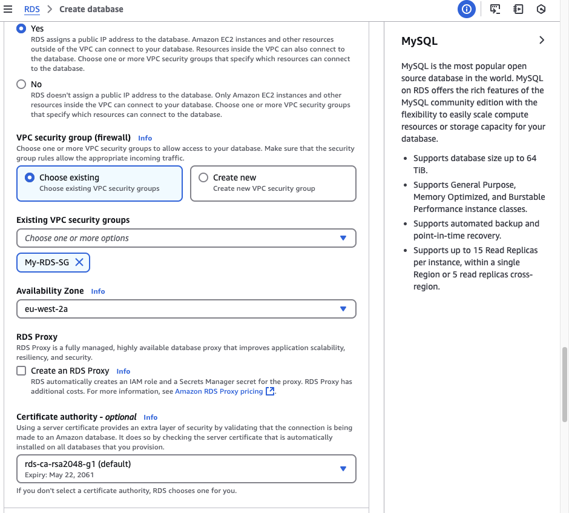
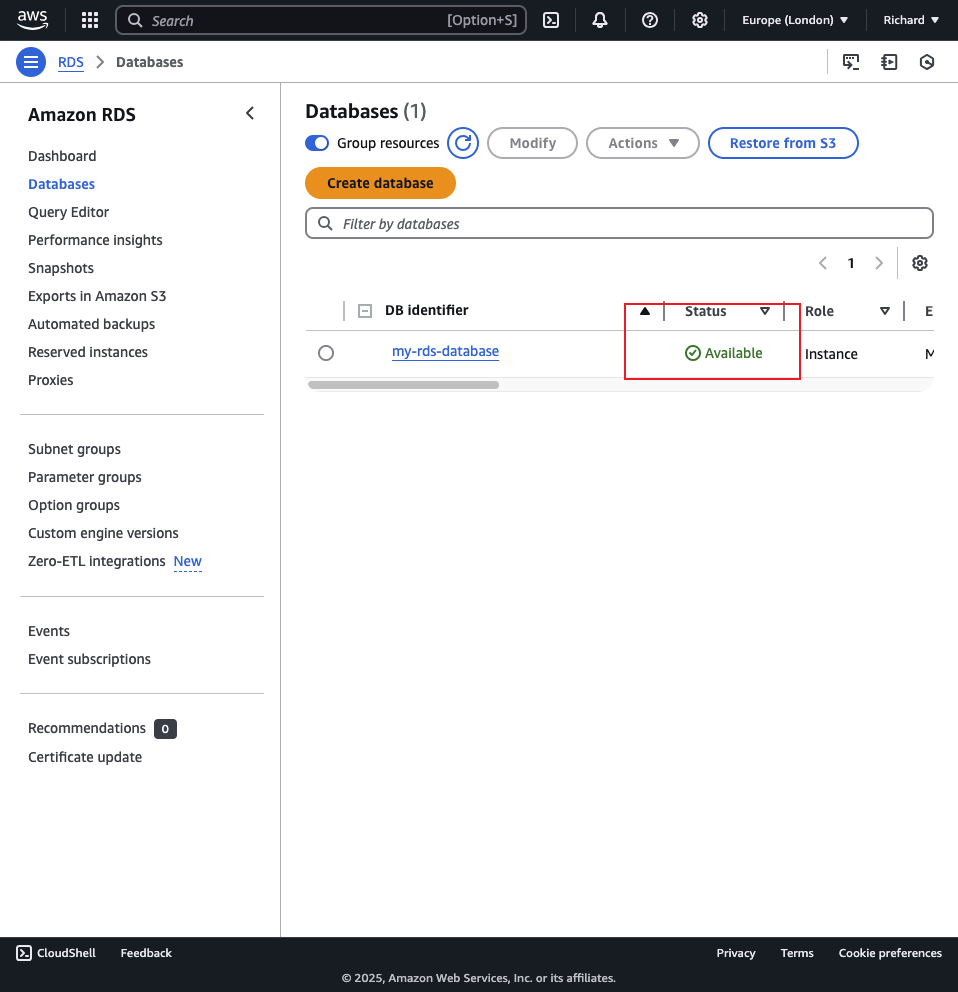
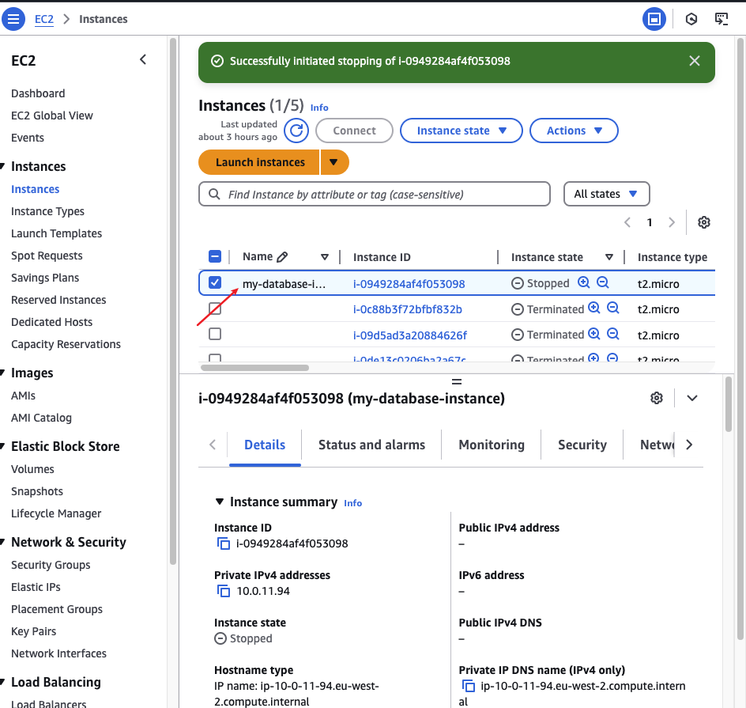
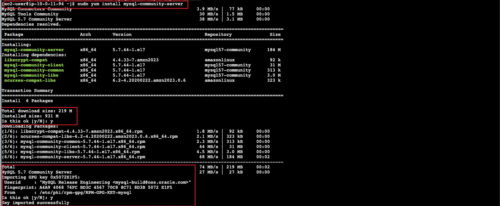
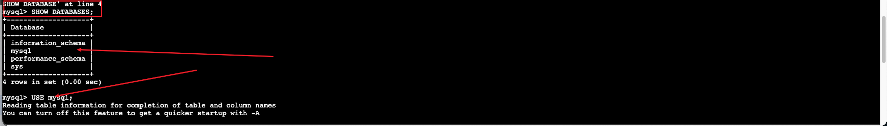

# Database-Management-with-Amazon-RDS
This is repository for Database management with Amazon RDS

> Company Profile 

GatoGrowFast is a fast IT service compnay that provide software development cloud solution, and cybersecurity service to businesses. With an increasin number of clients and projects, the company needs a strong and reliable database to handle all its data. This includes keeping track of client details, managing project information, and processing service orders. As the business keeps expanding, the amount of data is getting bigger and more complex, so they need a database system that can keep up.

## Project Aim 

- This project aim is helping GatoGrowFast manage to expending data needs with a reliable database solution.

- To achived this we will be setting up and managing database using Amazon RDC to help handle client data and project information effectively.

## Step 1 Creating database 

# Configuration

> Navigate to the RDS from AWS console, once found, click on the RDS option and proceed to create a database.

> On this step we will be using Standard database creation and MYSQL engine, this help to store and manage information in an organized way.

> Engine version MYSQL 8.0.40 and free tier template will be used 

> DB instance indentifier is name as *my-rds-database* and the credential management is set as *self managed* and a personal paasword was used.

> The Database instance class is confiqured as *db.t3.micro* storage was choose as general purpose SSD (gp2) and allocated as 20, my previous VPC was added as connectivity.

> Existing Vpc was added *my_RDS-SG* and added availiblity zone. A new security group was created *My-RDS-SG* that allow inbound all trafic port-80

> After configuring the database setting we were able to create an available database.

> Typically, creating a database take some times. to monitor the progress we can refresh the page periodically. after oberserving for a period of time the database is now available to for use.

## Step 2 - lunch Ec2 

> The next step is too create an EC2 instance and attached with the security group connected with our databased 

> We will be using SSH to connect with the EC2 instance

> Next we will be using command `sudo wget https://dev.mysql.com/get/mysql57-community-release-el7-11.noarch.rpm` 

> This command is used to download the repository package for MySQL 5.7. Once downloaded, this .rpm file allows the user to configure the MySQL YUM repository, enabling the installation of MySQL server and related tools using package managers like yum

> Next step is too install sudo yum by using this command install the package and confiqure the system to use mysQl

> `sudo yum localinstall mysql57-community-release-el7-11.noarch.rpm`

> The next step is too import the GPG key for my MySQL repository to our system using this command. 

> `sudo rpm --import https://repo.mysql.com/RPM-GPG-KEY-mysql-2022`

> When you use yum to install packages from the MySQL repository, your system verifies that these packages are signed with a trusted GPG key. Importing this key enables the verification process, ensuring the packages are secure and have not been altered.

> THe next  stage we will be installing MysQL database server om the amazon EC2 instance using this command  `sudo yum install mysql-community-server`

> Using this command `sudo systemctl start mysqld` we will be starting the MysQL service and allowing the service interact with the database hosted on the server.

> Using this command will  enable the MySQL service to start the automatically when the system boots up for convinnience with this command we dont need to start the MySQL server manully everytime we restart the instance. `sudo systemctl enable mysqld`

> To display the current status of the MySQL service we will use command `sudo systemctl status mysqld` currently the MySQL service is status is active and running as seen below.

##  step 3 - connect RDS to EC2 instance

> This command allow you to interact with a MySQL dataabse server and connect RDS to EC2 instance `mysql -h my-rds-database.ctyykuys07nw.eu-west-2.rds.amazonaws.com -u admin -p` using the password for the specific username while creating the database

> To view all databse, we will imply type in *SHOW DATABASES* on the terminal. 

> To use databse we have created we will type in *USE mysql*

> To show the table inside the databas, we will type in *SHOW TABLE* on the terminal

## Outcome

> By utilizing Amazon RDS with MySQL, GatoGrowFast can now effectively manage its expanding data requirements. This configuration ensures the scalability, security, and reliability essential for supporting the company's growth and development.

